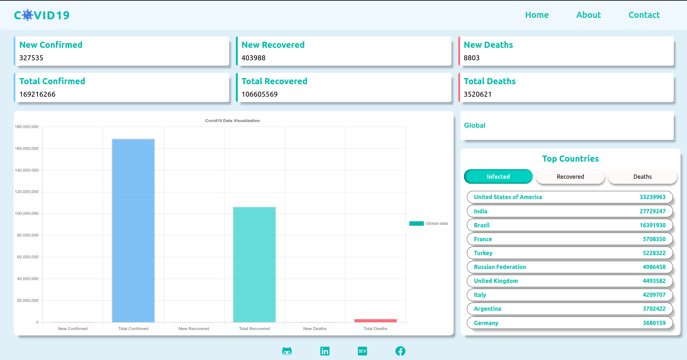

Covid-19 Tracker

Designed and Developed By Sajjat Hossain

***
> About : Here you'll find daily updates of Covid19 situation of the whole world. There is a selector from where you can find information about a specific country. The chart shows the conditions of new cases compared to total cases.

***

> Technoligies Used :
- React.js
- Context Api (for state management)
- Covid19 Api
- CSS3
- HTML5
***

> Note : Currently it only works on large screen devices!